<div align="center">

# ALLAH Everywhere

**Your whole deen in one app: prayer times, Quran, Hadith, duas, Hifz, Qibla and more,<br>
in 8 languages, in light and dark mode, with no pop-up ads.**

Flutter · iOS & Android · English · العربية · اردو · Français · Deutsch · हिन्दी · Türkçe · 中文

<a href="https://apps.apple.com/app/id6811425021">App Store</a> ·
<a href="https://play.google.com/store/apps/details?id=com.allaheverywhere.app">Google Play</a>

</div>

> **© Muhammad Abdullah Waseem. All rights reserved.** This code is published for viewing only.
> You may not copy, use, modify or distribute any part of it. See [LICENSE](LICENSE).

---

## Screenshots

<table>
  <tr>
    <td align="center">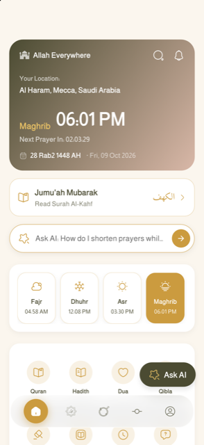<br><sub>Home</sub></td>
    <td align="center">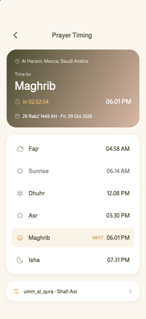<br><sub>Prayer times</sub></td>
    <td align="center">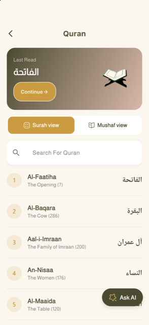<br><sub>Quran</sub></td>
    <td align="center">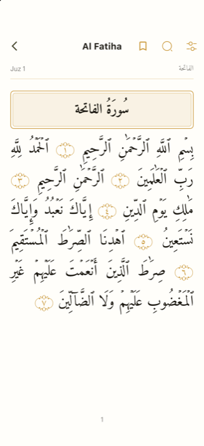<br><sub>Mushaf page view</sub></td>
  </tr>
  <tr>
    <td align="center">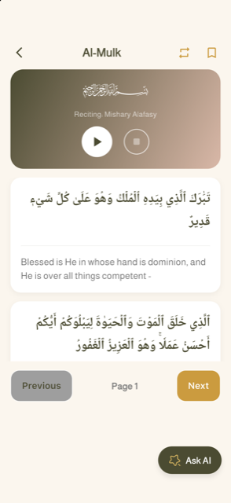<br><sub>Surah reader & audio</sub></td>
    <td align="center">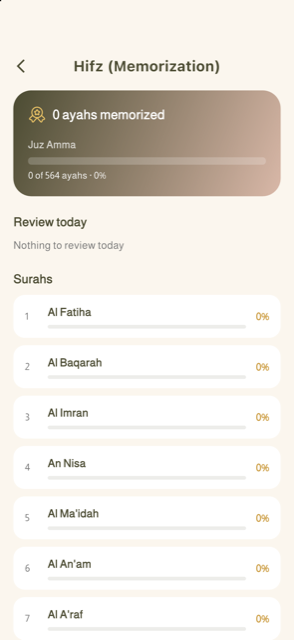<br><sub>Hifz mode</sub></td>
    <td align="center">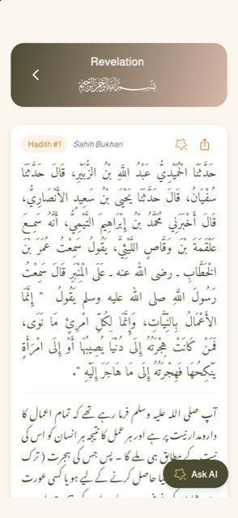<br><sub>Hadith collections</sub></td>
    <td align="center">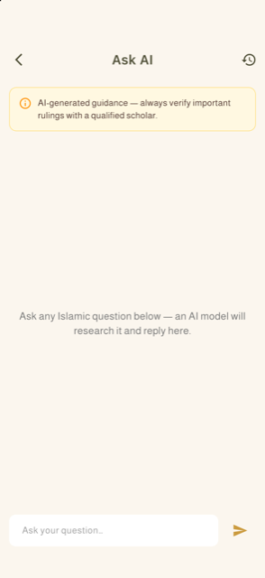<br><sub>Ask AI</sub></td>
  </tr>
  <tr>
    <td align="center">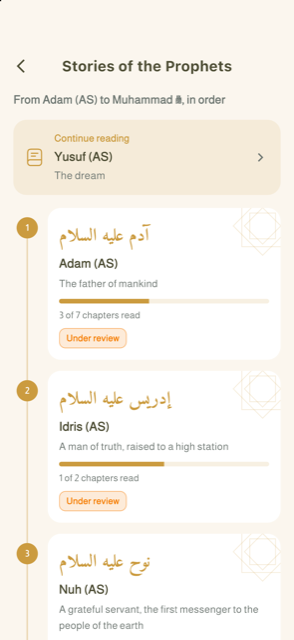<br><sub>Stories of the Prophets</sub></td>
    <td align="center">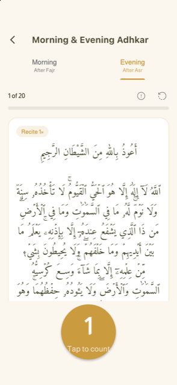<br><sub>Morning & evening adhkar</sub></td>
    <td align="center">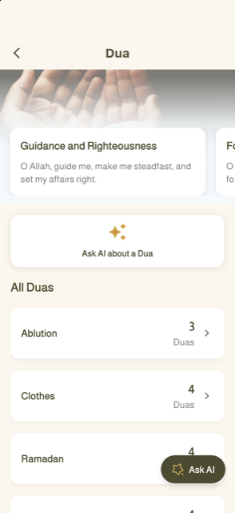<br><sub>Duas</sub></td>
    <td align="center">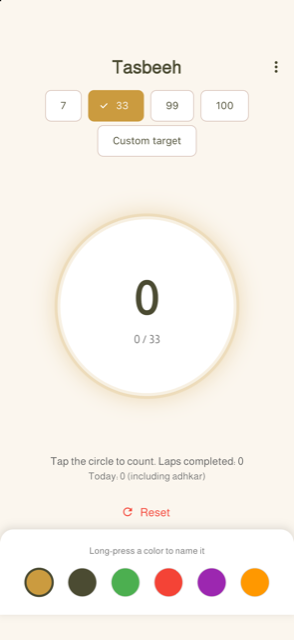<br><sub>Tasbeeh</sub></td>
  </tr>
  <tr>
    <td align="center">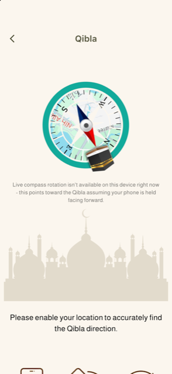<br><sub>Qibla</sub></td>
    <td align="center">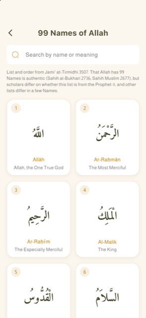<br><sub>99 Names of Allah</sub></td>
    <td align="center">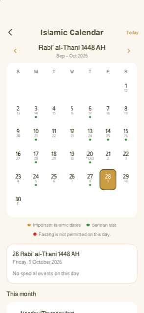<br><sub>Islamic calendar</sub></td>
    <td align="center">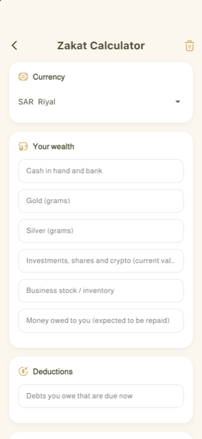<br><sub>Zakat calculator</sub></td>
  </tr>
</table>

<details>
<summary><b>Dark mode</b></summary>
<br>
<table>
  <tr>
    <td align="center">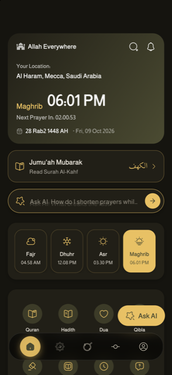<br><sub>Home</sub></td>
    <td align="center">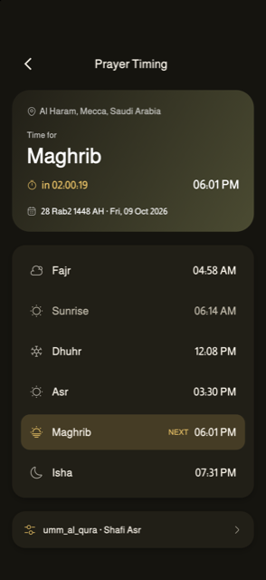<br><sub>Prayer times</sub></td>
    <td align="center">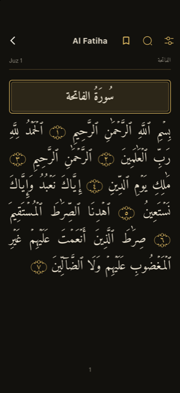<br><sub>Mushaf page view</sub></td>
    <td align="center">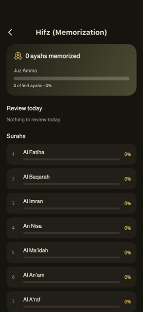<br><sub>Hifz mode</sub></td>
  </tr>
  <tr>
    <td align="center">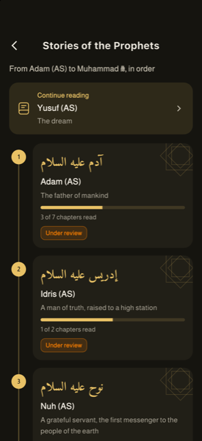<br><sub>Stories of the Prophets</sub></td>
    <td align="center">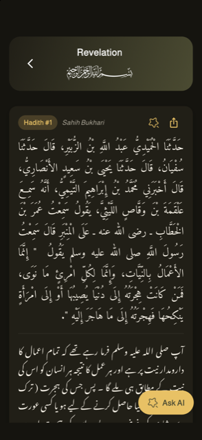<br><sub>Hadith</sub></td>
    <td align="center">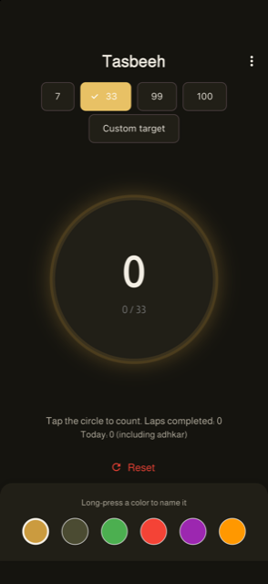<br><sub>Tasbeeh</sub></td>
    <td align="center">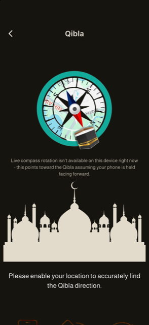<br><sub>Qibla</sub></td>
  </tr>
  <tr>
    <td align="center">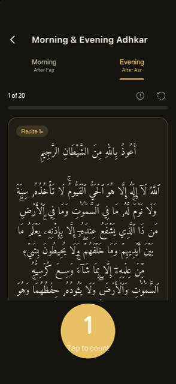<br><sub>Adhkar</sub></td>
    <td align="center">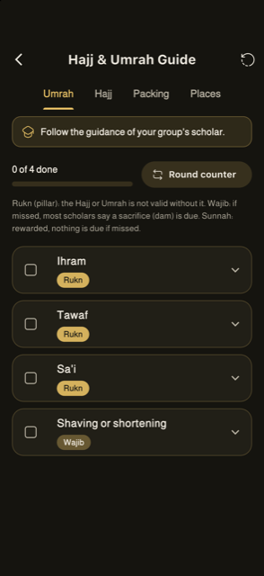<br><sub>Hajj & Umrah</sub></td>
    <td align="center">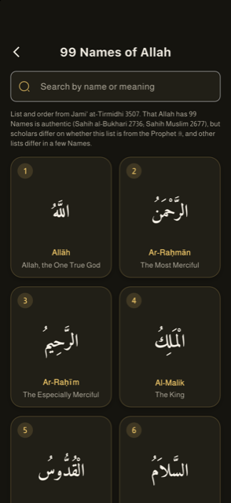<br><sub>99 Names</sub></td>
    <td align="center">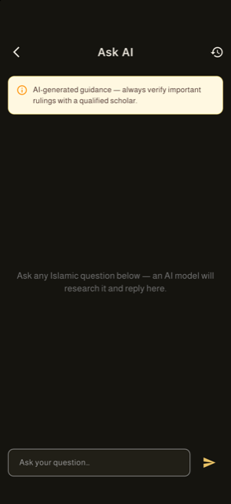<br><sub>Ask AI</sub></td>
  </tr>
</table>
</details>

---

## Features

### Prayer
- **Prayer times** for your location with the Adhan, several calculation methods and madhabs, and a choice of Adhan sounds.
- **Qibla compass** that works anywhere.
- **Nearby mosques** from OpenStreetMap.
- **Home screen widgets** for iOS and Android: next prayer, Hijri date and a daily reminder.

### Quran
- The full Quran with translation, in a **surah reader** or a printed-style **Mushaf page view**.
- Recitation by your favourite **reciter**, with background playback.
- **Hifz mode**: memorize ayah by ayah with repeat settings and spaced review, plus a dashboard of what you know.
- Bookmarks and "continue where you left off".

### Hadith, duas and remembrance
- **9 Hadith collections** with chapters and search.
- **Duas** by category, and **morning and evening adhkar** with counters and reminders.
- **Tasbeeh** with several counters, targets and a lifetime total.
- **99 Names of Allah** with meanings.
- **Ask AI**: answers grounded in the Quran and authentic Hadith, with references.

### Learn
- **Stories of the Prophets**: 25 Prophets, with a Kids mode, reading progress, quizzes and a Story of the day.
- **Seerah**, **Tib-e-Nabwi**, **Fiqh** and a **Hajj & Umrah** step-by-step guide.
- **Islamic calendar** with the Hijri date, important days and sunnah-fast reminders.
- **Zakat calculator**.

### Challenges (with family and friends)
- **Create a challenge**, for example "Read the whole Quran in 10 days" or "Memorize Surah Al-Mulk in 3 days". Templates: Khatam, read Quran, memorize a surah, ahadith, dhikr / durood, voluntary fasts, Tahajjud / Fajr on time, or your own.
- **Invite with a 6-letter code.** Everyone logs their progress, and you can keep your exact numbers private and share only a percentage.
- **Challenge screen**: progress ring, leaderboard, chat-style feed with reactions (MashaAllah, BarakAllahu feek, Ameen…), gentle nudges, and a celebration when someone finishes.
- **Notifications** in each person's own language, with a daily reminder if you fall behind and on the last day.
- **Dua Wall**: when a challenge ends, family members write a dua for each person who completed it.
- **Dedicate a challenge**, e.g. "For my late grandmother", and add a **Family Promise**, e.g. "Winner chooses Friday dinner".

### Rewards (earned, never bought)
- **Badges**: First Challenge, Khatam Finisher, Steadfast, Early Bird, Encourager, Family Builder, Comeback and more.
- **Certificates** for completed challenges, shared as an image or PDF.
- **My Jannah Garden**: a calm garden that grows with every completed challenge, finished Khatam, memorized surah and 1,000 dhikr. *"This garden is a reminder. The real garden is with Allah."*
- **Unlocks**: app colour themes (Madinah Green, Night of Qadr, Desert Gold), Mushaf page frames, Tasbeeh bead styles and profile frames.
- No core feature is ever locked behind a reward.

### Sharing
- **Share cards**: turn an ayah or hadith into a beautiful image for WhatsApp Status or Instagram.

### For everyone
- **8 languages** with full right-to-left support for Arabic and Urdu.
- Light and dark mode, large-text friendly layouts and screen-reader labels.
- Most features work as a **guest** and offline; an account is only needed for sharing features such as Challenges.
- **No pop-up ads**: one small banner only.

---

## Built with

- **Flutter** with GetX for state and navigation.
- **Firebase**: Auth, Firestore, Storage, Cloud Messaging, Analytics, Crashlytics and **Cloud Functions** (TypeScript, in `functions/`).
- Firestore **security rules** in `firestore.rules`, with emulator tests in `firestore-tests/`.
- Local notifications, home screen widgets (Swift / Kotlin), and audio playback.

---

## For the developer

<details>
<summary><b>Running the app</b></summary>

API keys are passed at build time and never committed. Copy `dart_defines.example.json` to `dart_defines.json` (git-ignored), fill in the keys, then:

```sh
flutter run --dart-define-from-file=dart_defines.json
```

The Hadith screens call hadithapi.com and need `HADITH_API_KEY`. Without it they show a clear "not configured" message.
</details>

<details>
<summary><b>Firebase: rules, indexes and Cloud Functions</b></summary>

```sh
cd functions && npm install && cd ..
firebase deploy --only firestore:rules,firestore:indexes,functions
```

- Deploying `firestore.rules` **replaces** the rules in the Firebase console.
- Cloud Functions need the **Blaze** plan. iOS pushes need an APNs key uploaded in Firebase → Project settings → Cloud Messaging.
- More detail is in [`functions/README.md`](functions/README.md).
</details>

<details>
<summary><b>Tests</b></summary>

```sh
flutter test                         # app unit and widget tests
cd firestore-tests && npm test       # Firestore rules (needs Java 21)
cd functions && npm test             # Cloud Functions (needs Java 21)
```
</details>

<details>
<summary><b>Android release signing</b></summary>

`android/app/build.gradle` reads `android/key.properties` (git-ignored, never committed) to sign release builds. Without it, release builds fall back to the debug key.

1. Copy `android/key.properties.example` to `android/key.properties`.
2. Create a keystore if you don't have one:
   ```sh
   keytool -genkeypair -v -keystore android/app/upload-keystore.jks -storetype JKS \
     -keyalg RSA -keysize 2048 -validity 10000 -alias upload
   ```
3. Fill in the passwords and alias in `android/key.properties`.
4. **Back up the keystore and `key.properties` somewhere safe.** If they are lost after publishing, the Play Store listing can never be updated again.
</details>

<details>
<summary><b>External services</b></summary>

| Service | Used for |
|---|---|
| `quranapi.pages.dev` | Surah list metadata |
| `hadithapi.com` | Hadith books, chapters and text (API key) |
| OpenStreetMap Overpass | Nearby mosques |
| Firebase | Accounts, sync, notifications, analytics |

Quran text is bundled with the app (`quran` package), so reading works offline.
</details>

---

<div align="center">

**© 2025–2026 Muhammad Abdullah Waseem. All rights reserved.**<br>
Viewing this repository does not grant any right to copy, use or distribute its code. See [LICENSE](LICENSE).

</div>
