<p align="center">
  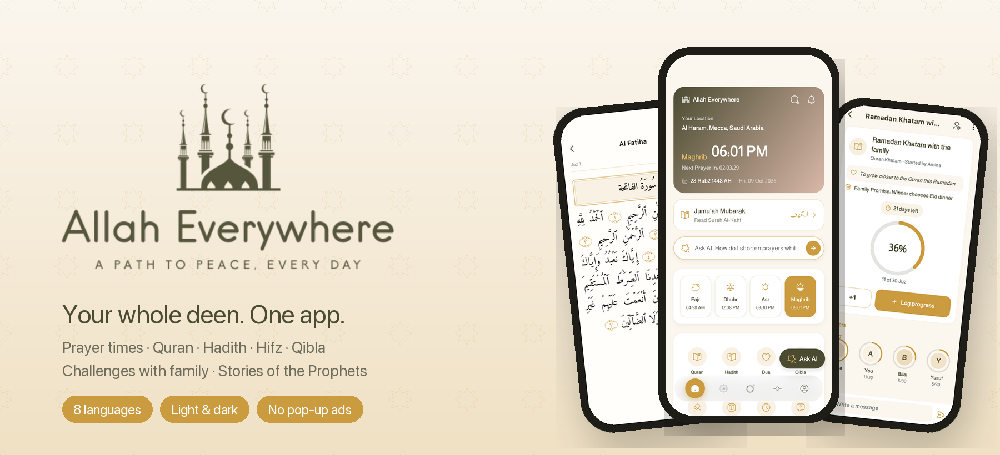
</p>

<p align="center">
  <a href="https://apps.apple.com/app/id6811425021"></a>
  <a href="https://play.google.com/store/apps/details?id=com.allaheverywhere.app"></a>
</p>

<p align="center">
  
  
  
  
  
</p>

<h3 align="center">Your whole deen. One app.</h3>

<p align="center">
Prayer times, the Quran, Hadith, duas, Hifz, Qibla, Stories of the Prophets and<br>
challenges with your family: in 8 languages, in light and dark mode, with no pop-up ads.
</p>

---

## Contents

- [What's new](#whats-new)
- [Screenshots](#screenshots)
- [Features](#features)
- [Languages](#languages)
- [Our principles](#our-principles)
- [How it's built](#how-its-built)
- [For the developer](#for-the-developer)
- [License](#license)

---

## What's new

<table>
<tr>
<td width="33%" valign="top">

### 🤝 Challenges
Set a goal together, like *"Read the whole Quran in 10 days"* or *"Memorize Surah Al-Mulk in 3 days"*. Invite family with a 6-letter code, log progress, cheer each other on in a chat-style feed and get gentle reminders.

</td>
<td width="33%" valign="top">

### 🌴 Rewards
Earn badges, certificates and a calm **Jannah Garden** that grows with every challenge, Khatam, memorized surah and 1,000 dhikr. Rewards are only ever earned. Nothing can be bought.

</td>
<td width="33%" valign="top">

### 📖 Stories of the Prophets
The stories of 25 Prophets, from Adam to Muhammad ﷺ, in 8 languages, with a Kids mode, quizzes and a Story of the day.

</td>
</tr>
</table>

---

## Screenshots

### Daily worship

<table>
  <tr>
    <td align="center"><br><sub><b>Home</b></sub></td>
    <td align="center"><br><sub><b>Prayer times</b></sub></td>
    <td align="center"><br><sub><b>Qibla</b></sub></td>
    <td align="center"><br><sub><b>Tasbeeh</b></sub></td>
  </tr>
</table>

### Quran and memorization

<table>
  <tr>
    <td align="center"><br><sub><b>Quran</b></sub></td>
    <td align="center"><br><sub><b>Reader & recitation</b></sub></td>
    <td align="center"><br><sub><b>Mushaf page view</b></sub></td>
    <td align="center"><br><sub><b>Hifz mode</b></sub></td>
  </tr>
</table>

### Challenges with family and friends

<table>
  <tr>
    <td align="center">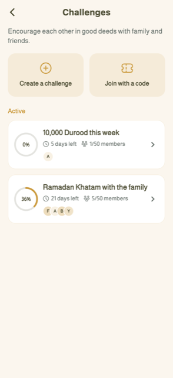<br><sub><b>My challenges</b></sub></td>
    <td align="center">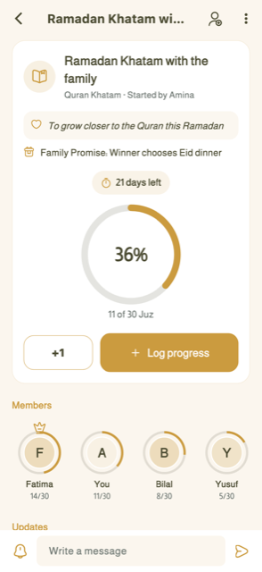<br><sub><b>Progress & leaderboard</b></sub></td>
    <td align="center">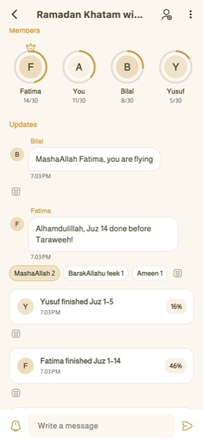<br><sub><b>Family feed</b></sub></td>
    <td align="center">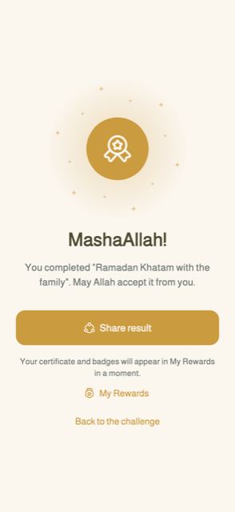<br><sub><b>MashaAllah!</b></sub></td>
  </tr>
</table>

### Rewards

<table>
  <tr>
    <td align="center">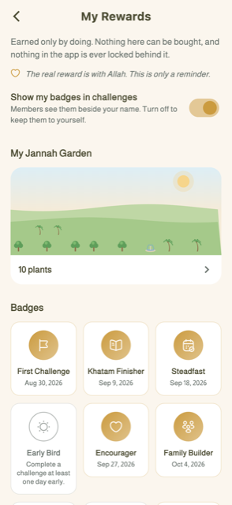<br><sub><b>My Rewards</b></sub></td>
    <td align="center">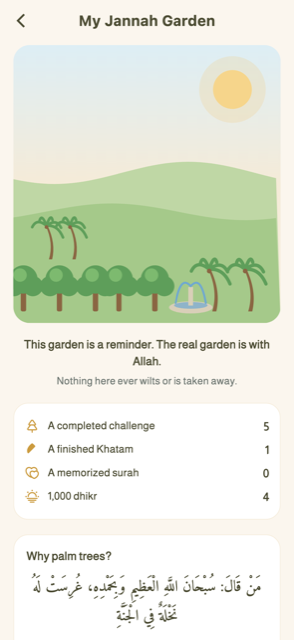<br><sub><b>Jannah Garden</b></sub></td>
    <td align="center">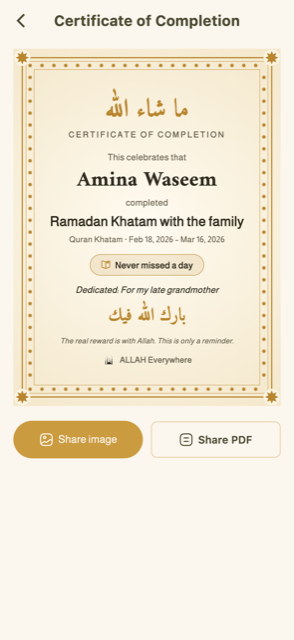<br><sub><b>Certificate</b></sub></td>
    <td align="center">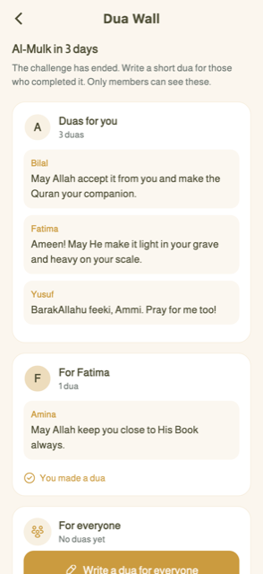<br><sub><b>Dua Wall</b></sub></td>
  </tr>
</table>

### Learn and grow

<table>
  <tr>
    <td align="center"><br><sub><b>Stories of the Prophets</b></sub></td>
    <td align="center"><br><sub><b>Hadith collections</b></sub></td>
    <td align="center"><br><sub><b>Morning & evening adhkar</b></sub></td>
    <td align="center"><br><sub><b>Ask AI</b></sub></td>
  </tr>
  <tr>
    <td align="center"><br><sub><b>99 Names of Allah</b></sub></td>
    <td align="center"><br><sub><b>Islamic calendar</b></sub></td>
    <td align="center">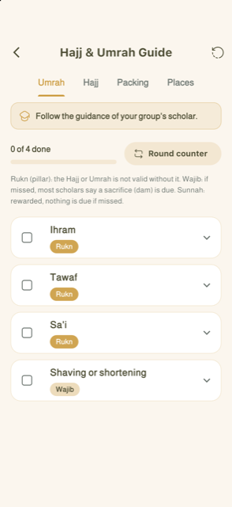<br><sub><b>Hajj & Umrah guide</b></sub></td>
    <td align="center"><br><sub><b>Zakat calculator</b></sub></td>
  </tr>
</table>

### Dark mode

<table>
  <tr>
    <td align="center"><br><sub><b>Home</b></sub></td>
    <td align="center"><br><sub><b>Mushaf</b></sub></td>
    <td align="center">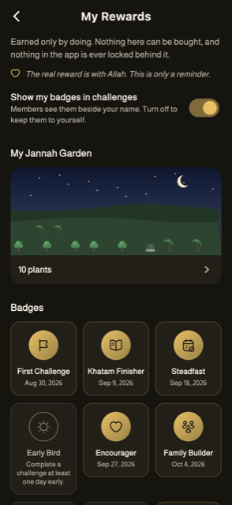<br><sub><b>My Rewards</b></sub></td>
    <td align="center">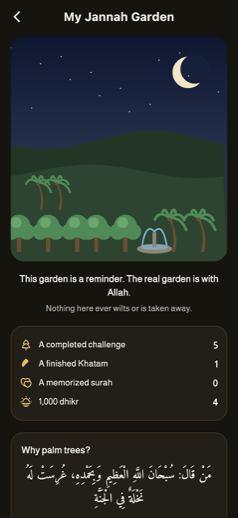<br><sub><b>Garden at night</b></sub></td>
  </tr>
</table>

---

## Features

<details open>
<summary><b>🕌 Prayer</b></summary>

- **Prayer times** for your exact location, with several calculation methods and madhabs.
- **Adhan alerts** with a choice of Adhan sounds, plus Jumu'ah and Surah Al-Kahf reminders.
- **Qibla compass** that works anywhere in the world.
- **Nearby mosques**, found through OpenStreetMap.
- **Home screen widgets** on iOS and Android: next prayer, Hijri date and a daily reminder.

</details>

<details open>
<summary><b>📗 Quran</b></summary>

- The complete Quran with translation, in a **surah reader** or a printed-style **Mushaf page view**.
- Recitation by your favourite **reciter**, with background playback.
- **Hifz mode**: memorize ayah by ayah with repeat settings and spaced review, and see your progress.
- Bookmarks and "continue where you left off". Quran text is bundled, so reading works offline.

</details>

<details open>
<summary><b>📚 Hadith, duas and remembrance</b></summary>

- **9 Hadith collections** with chapters and search.
- **Duas** by category, and **morning and evening adhkar** with counters and reminders.
- **Tasbeeh** with several counters, targets and a lifetime total.
- **99 Names of Allah** with meanings.
- **Ask AI**: answers grounded in the Quran and authentic Hadith, with references.

</details>

<details open>
<summary><b>🤝 Challenges</b></summary>

- **8 templates**: Quran Khatam, read Quran, memorize a surah, memorize ahadith, dhikr or durood, voluntary fasts, Tahajjud or Fajr on time, or your own goal.
- **Invite with a 6-letter code**, up to 50 members. Each member can share exact numbers or only a percentage.
- **Log progress your way**: tap +1, tick the Juz you finished, enter page ranges or tick memorized ayahs.
- **Family feed**: progress updates, messages and reactions (MashaAllah, BarakAllahu feek, Ameen, 🤲, ❤️), with gentle nudges for anyone who hasn't logged today.
- **Notifications** in each member's own language, a reminder if you fall behind, and one on the last day.
- **Dedicate a challenge** (for example "For my late grandmother") and add a **Family Promise** (for example "Winner chooses Friday dinner").
- **Safe by design**: only people with the code can join, there is no public leaderboard with strangers, messages are filtered, and anything can be reported.

</details>

<details open>
<summary><b>🌴 Rewards</b></summary>

- **Badges**: First Challenge, Khatam Finisher, Steadfast, Early Bird, Encourager, Family Builder, Comeback, First Surah and dhikr milestones.
- **Certificates** for completed challenges, with an Islamic geometric border and Amiri calligraphy, shared as an image or PDF.
- **My Jannah Garden**: a tree for every completed challenge, a fountain for every Khatam, a flower for every memorized surah, and a palm for every 1,000 dhikr. Nothing ever wilts.
- **Dua Wall**: when a challenge ends, family members write a dua for everyone who completed it.
- **Unlocks**: app colour themes (Madinah Green, Night of Qadr, Desert Gold), Mushaf page frames, Tasbeeh bead styles and profile frames.
- Badges can be hidden from others, to avoid showing off.

</details>

<details open>
<summary><b>🌙 Learn</b></summary>

- **Stories of the Prophets**: 25 Prophets with chapters, Kids mode, quizzes and reading progress.
- **Seerah**, **Tib-e-Nabwi** and **Fiqh** sections.
- **Hajj & Umrah**: a step-by-step guide.
- **Islamic calendar**: Hijri dates, important days and sunnah-fast reminders.
- **Zakat calculator**.
- **Share cards**: turn an ayah or hadith into a beautiful image for WhatsApp Status or Instagram.

</details>

---

## Languages

The whole app, including notifications, is available in:

| English | العربية | اردو | Français | Deutsch | हिन्दी | Türkçe | 中文 |
|:---:|:---:|:---:|:---:|:---:|:---:|:---:|:---:|
| English | Arabic | Urdu | French | German | Hindi | Turkish | Chinese |

Arabic and Urdu are fully right-to-left.

---

## Our principles

| | |
|---|---|
| 🕊️ **Calm, not addictive** | No pop-up ads, only one small banner. No streak guilt, and nothing in the garden ever dies. |
| 🎁 **Earned, never bought** | Rewards come only from doing. There are no paid boosts, and no religious content is locked behind a reward. |
| 🤲 **Sincere intention** | Every challenge reminds you to purify your intention, and badges can be kept private. *"The real reward is with Allah."* |
| 🔒 **Private by default** | Challenges are visible only to people with the code. Most features work as a guest and offline. |
| 📜 **Sourced content** | Quran and Hadith come from established sources, with references shown. New religious content is reviewed before release. |
| ♿ **For everyone** | Light and dark mode, large-text friendly layouts, screen-reader labels and full RTL support. |

---

## How it's built

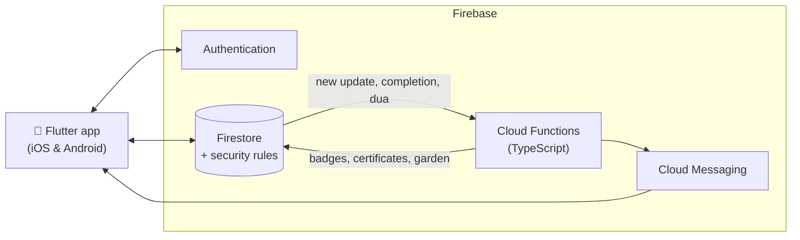

| Layer | Technology |
|---|---|
| App | Flutter, GetX, flutter_screenutil, gen-l10n (8 languages) |
| Backend | Firebase Auth, Cloud Firestore, Cloud Storage, Cloud Messaging, Analytics, Crashlytics |
| Server logic | Cloud Functions for Firebase (TypeScript): notifications, reminders, reward awarding |
| Security | Firestore security rules, tested with the Firebase emulator |
| Native | Home screen widgets in Swift (WidgetKit) and Kotlin, local notifications, background audio |

<details>
<summary><b>Project structure</b></summary>

```text
lib/
├── main.dart                  App start, theme and language
├── home.dart                  Home screen
├── challenges.dart            Challenges hub, create and join
├── challenge_detail.dart      Challenge screen: progress, leaderboard, feed
├── rewards.dart               My Rewards, badges, Jannah Garden, certificates
├── prophet_stories.dart       Stories of the Prophets
├── controllers/               GetX controllers (theme, language, prayer times…)
├── services/                  Business logic and Firebase access
├── models/                    Data models
├── data/                      Bundled content and definitions
├── widgets/                   Shared UI components
└── l10n/                      Translations (8 languages)
functions/                     Cloud Functions (TypeScript)
firestore.rules                Firestore security rules
firestore-tests/               Security rules tests
test/                          Unit and widget tests
ios/  android/                 Native projects, widgets and notification sounds
```
</details>

---

## For the developer

<details>
<summary><b>Run the app</b></summary>

API keys are passed at build time and are never committed. Copy `dart_defines.example.json` to `dart_defines.json` (git-ignored), fill in the keys, then run:

```sh
flutter pub get
flutter run --dart-define-from-file=dart_defines.json
```
</details>

<details>
<summary><b>Deploy Firebase rules, indexes and functions</b></summary>

```sh
cd functions && npm install && cd ..
firebase deploy --only firestore:rules,firestore:indexes,functions
```

- Deploying `firestore.rules` **replaces** the rules in the Firebase console.
- Cloud Functions need the **Blaze** plan. iOS pushes also need an APNs key in Firebase → Project settings → Cloud Messaging.
- See [`functions/README.md`](functions/README.md) for details.
</details>

<details>
<summary><b>Run the tests</b></summary>

```sh
flutter test                         # app unit and widget tests
cd firestore-tests && npm test       # security rules (needs Java 21)
cd functions && npm test             # Cloud Functions (needs Java 21)
```
</details>

<details>
<summary><b>Android release signing</b></summary>

`android/app/build.gradle` reads `android/key.properties` (git-ignored) to sign release builds. Without it, release builds fall back to the debug key.

1. Copy `android/key.properties.example` to `android/key.properties`.
2. Create a keystore:
   ```sh
   keytool -genkeypair -v -keystore android/app/upload-keystore.jks -storetype JKS \
     -keyalg RSA -keysize 2048 -validity 10000 -alias upload
   ```
3. Fill in the passwords and alias in `android/key.properties`.
4. **Back up the keystore and `key.properties` safely.** If they are lost after publishing, the Play Store app can never be updated again.
</details>

---

## License

**Copyright © 2025–2026 Muhammad Abdullah Waseem. All rights reserved.**

This repository is public for **viewing only**. No part of it (code, design, graphics, text or translations) may be copied, used, modified, published or distributed, and it may not be used to build or publish any app, without written permission. See the full [LICENSE](LICENSE).

Third-party packages, fonts and religious texts remain under their own licenses.

For permission requests: **maw112266@gmail.com**

<p align="center">
  <br>
  <br>
  <sub><b>ALLAH Everywhere</b> · <i>A path to peace, every day</i></sub>
</p>
